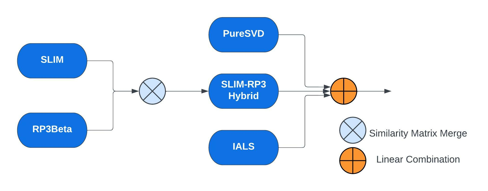

# TV-Show Recommender

The goal of the competition was to create the recommender system for TV programs by providing 10 recommended products to each user. 

## Data

Given the User Rating Matrix and four Item Content Matrices we had to recommend 10 relevant tv shows to the users. 

The URM contained 5M interactions, 13650 users and 18059 item and a sparsity of 97.86 %.

The ICMs contained information about the channels, episodes, genre and subgenre of the shows.

All data was anonymized, so it was not possible to perform text analysis, genre grouping, correlation between text and popularity and so on.

## Recommender

  

Our final recommender was a hybrid, obtained combining of the following models:
* SLIM ElasticNet
* RP3Beta 
* PureSVD
* Implicit Alternating Least Squares 

The final hybrid was obtained as a linear combination of the ratings of PureSVD + IALS + hybrid(SLIM + RP3Beta).

The hybrid combining SLIM and RP3Beta merges their similarity matrices with a weighted sum.